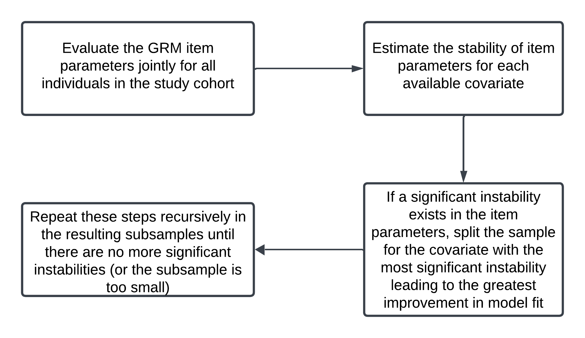

```{r setup, include=FALSE}
knitr::opts_chunk$set(
  collapse = TRUE,
  comment = "#>",
  fig.width = 7,
  fig.height = 5
)
```

# Introduction

The `grmtree` package implements recursive partitioning for Graded Response Models (GRM), allowing researchers to test for differential item functioning (DIF) and identify heterogeneous subgroups in their data based on item response patterns and covariates. This vignette describes the implementation of the tree-based graded response model (GRMTree) to test for DIF on the sample Medical Outcomes Study Social Support Survey (MOS-SS). This vignette demonstrates:

* Data preparation and exploration

* Unidimensionality checking

* GRM fitting

* GRMTree construction and interpretation

# Install and Load required packages
To implement the tree-based GRM (GRMTree), you will install the following packages if not previously installed.
```{r, eval=F}
## Install packages from CRAN repository
install.packages(c("dplyr", "grmtree", "mirt", "psych"))
```

Once installed, load the packages as follows:
```{r, message=FALSE, warning=FALSE}
library(dplyr)        # For data manipulation
library(grmtree)      # For tree-based GRM DIF Test
library(mirt)         # For traditional GRM
library(psych)        # For psychometrics
```

# Import and explore the data

The data set used in this demonstration is a test/sample data for the package.

**Now, let's load this tidy data set into R.**

```{r, message=FALSE}
## Load the data
data("grmtree_data", package = "grmtree")

## Take a glimpse at the data
glimpse(grmtree_data)
```

# IRT Assumptions: Check for unidimensionality assumption

There are various ways to check for the unidimensionality assumption. Some including using exploratory factor analysis (through parallel analysis), scree plot of the eigen values, and contrasts from principal component analysis.

Here, we will use the scree plot of eigen values. Reeve, et al. suggested that a ratio of first-to-second eigenvalues greater than four is evidence of unidimensionality.

```{r, warning=FALSE}
## Create the response data (the 8 MOS-SS items)
response_data <- grmtree_data %>% 
  dplyr::select(MOS_Listen:MOS_Understand) %>% 
  mutate_at(vars(starts_with("MOS")), as.ordered)

## Create response as outcomes
response_data$resp <- data.matrix(response_data[, 1:8])

## Calculate the polychoric correlation of items 
polycorr_mos <- polychoric(response_data$resp, global=FALSE)$rho

## Return the eigen values
polycorr_eigen_mos <- eigen(polycorr_mos)$values
round(polycorr_eigen_mos, 3)

## Ratio of first and second eigen value
mos_ratio <- round(round(polycorr_eigen_mos, 3)[1]/round(polycorr_eigen_mos, 3)[2],3)

## Print the result
mos_ratio

cat("The ratio of the first-to-second eigen value is", mos_ratio,
    "which is >4 suggesting that the unidimensionality assumption is satisfied", "\n")

```

Now, let's create the screen plot.

```{r}
## Scree plot of eigen values
plot(1:length(polycorr_eigen_mos), polycorr_eigen_mos, 
     type = "b", pch = 20, xlab = "", ylab = "Eigen values")
```

**Note:** The `type = "b"` argument means we desire that the plot creates both points and lines, 

Based on the scree plot, we assume that the MOS-SS emotional domain is unidimensional. This implies that one dominant latent trait is being measured and that this trait is the driving force for the responses observed for each item in the measure.

Other ways to check for unidimensionality of the MOS-SS emotional domain are shown below
```{r, eval=FALSE}
## Perform EFA with 1 factors
efa_mos <- fa(response_data$resp, nfactors = 1, rotate = "varimax", fm = "mle")

## Print the results
summary(efa_mos)
print(efa_mos, sort=TRUE)
efa_mos$loadings

## Visualizing factor structure using fa.diagram
fa.diagram(efa_mos, main = "EFA Factor Structure")

## Scree plot to visualize the number of factors
fa.parallel(response_data$resp, fa = "fa")
```


# Fit the graded response model (GRM)
Having established unidimensionality, let's create the GRM.
```{r}
## Create GRM
mos_grm <- mirt(data = response_data$resp, 
                model = 1,
                itemtype = "graded", SE = TRUE, method = "EM",
                verbose = FALSE)
```

**Note:** The argument `model = 1` means that default is 1, indicating that a unidimensional model will be fitted

## Fit Indices for the GRM
```{r}
## Get the coefficients
mos_coef <- coef(mos_grm, IRTpars = T, simplify = TRUE)
mos_coef

## Get the residuals
residuals(mos_grm, type = "Q3")

## Compute the M2 model fit statistic
M2(mos_grm, type = "C2")

## Infit and outfit statistics
mirt::itemfit(mos_grm, c('S_X2', 'infit'), method = 'ML')

## Could also use method = 'EAP'

## Person fit statistics
personfit_mirt <- mirt::personfit(mos_grm, method = 'ML')
summary(personfit_mirt$infit)
summary(personfit_mirt$outfit)
```

## Visualization: Visualize the results for all the items

```{r}
## Plot the category response curves
plot(mos_grm, type = 'trace')

## Plot the test information
plot(mos_grm, type = 'info')
```

# Fit the tree-based graded response model (GRMTree)
Based on multiple fit indices including the Tucker–Lewis index (TLI) and Comparative fit index (CFI), we conclude that GRM has a good fit to the data.

Now, let's create the GRNTree using covariates to test for DIF. To implement the GRMTree, it follows this four-step process.



Before we proceed, let's put the variables in their proper formats:

* All variables to be included in the model except `age` and `BMI` will be converted to factor since they are categorical variables and the MOS-SS emotional domain items will be converted to ordinal variables as required for the GRMTree.

```{r, warning=FALSE}

## Prepare the data
resp.data <- grmtree_data %>% 
  mutate_at(vars(starts_with("MOS")), as.ordered) %>% 
  mutate_at(vars(c(sex, residency, depressed,
                   Education, job, smoker,
                   multimorbidity)), as.factor) 

## Explore the data
head(resp.data)

## Check the structure of the data
glimpse(resp.data)

## Create response as outcomes
resp.data$resp <- data.matrix(resp.data[, 1:8])

## GRMTree control parameters with Benjamini-Hochberg
grm_control <- grmtree.control(
  minbucket = 350,
  p_adjust = "BH", alpha = 0.05)


## Fit the GRMTree model
mos_grmtree <- grmtree(resp ~ sex + age + bmi + Education + depressed +
                       residency + job + multimorbidity + smoker,  
                       data = resp.data,
                       control = grm_control)

## Another way implement the model 
## with the control parameters in the function (Bonferroni correction)
mos_grmtree_bon <- grmtree(resp ~ sex + age + bmi + Education + depressed +
                       residency + job + multimorbidity + smoker,  
                       data = resp.data,
                       control = grmtree.control(minbucket = 350,
                                                 p_adjust = "bonferroni"))
```

**Note:** Unlike previous tree-based item response theory models, currently, the `grmtree` package implemented other multiple adjustments methods apart from the Bonferroni correction. The implemented multiple adjustments methods include, "bonferroni" (Bonferroni), "holm" (Holm-Bonferroni), "BH" (Benjamini-Hochberg), "BY" (Benjamini-Yekutieli), "hochberg" (Hochberg), and "hommel" (Hommel). As it is known, the Bonferronni correction can be overly conservative, and implementing other methods like Benjamini-Hochberg (BH) and Holm-Bonferroni is a valuable addition to this package. 

See the `grmtree.control` for more information on other control arguments. Also see below an example of using other multiple comparison methods.

```{r, eval=FALSE}
## Bonferroni correction
tree_bonf <- grmtree(response ~ covariate1 + covariate2, data = df, 
                    control = grmtree.control(p_adjust = "bonferroni"))

## Hommel
tree_bh <- grmtree(response ~ covariate1 + covariate2, data = df,
                  control = grmtree.control(p_adjust = "hommel"))

## Holm-Bonferroni
tree_holm <- grmtree(response ~ covariate1 + covariate2, data = df,
                    control = grmtree.control(p_adjust = "holm"))
```

## Print the tree
We can print the tree using the `print()` function. Note that using `print(mos_grmtree)` will print the tree with the item parameters. The code below also includes a way to print a simplified version of the tree showing only the nodes.

```{r}
## Print the tree model
print(mos_grmtree)
print(mos_grmtree, FUN = function(x) " *")
```

## Plot the GRMTree
Now, we can plot the tree using the `plot()` function. We have implemented several plotting options including plot the distribution of the factor scores in each node overlayed by a normal curve. See `?plot` for options of plots available.
```{r}
## Create the regions plot (by default)
plot(mos_grmtree)

## This also creates a regions plot
plot(mos_grmtree, type = "regions",  tnex = 2L)

## Create the histogram plot of the factor scores
plot(mos_grmtree, type = "histogram",  tnex = 2L)

## Create the profile plot with different options
plot(mos_grmtree, type = "profile", tnex = 2L, what = "threshold")
plot(mos_grmtree, type = "profile", tnex = 2L, what = "discrimination")
plot(mos_grmtree, type = "profile", tnex = 2L, what = "item")
```

**Note:** The `tnex = 2L` argument is a numeric value giving the terminal node extension in relation to the inner nodes. 

You may also rename a covariate in the plot. Let's assume we want to rename the variable that splits at the root node from `age` to `Age`.

```{r}
## Return the names of the covariates to know the position of age
names(mos_grmtree$data)

## Rename the age to Age
names(mos_grmtree$data)[3] <- "Age"

## Create the regions plot (by default)
plot(mos_grmtree)
```
More than one subgroup (terminal node) was identified, suggesting the presence of sample heterogeneity with respect to DIF on the MOS-SS emotional domain items. Specifically, the GRMTree identified three distinct subgroups defined by interactions among age, sex and smoking status as splitting variables. Subgroup 1 consists of female patients who are ≤69 years old, subgroup 2 consists of males who are ≤69 years, and subgroup 3 consists of patients who are > 69 years. In the figure above, the larger the sections of the bars for each response category, the more likely patients are to endorse that category. For a more detailed example on the interpretation of these types of plot, see the article below.

* Arimoro, O.I., Josephson, C.B., James, M.T. et al. Screening for depression in patients with epilepsy: same questions but different meaning to different patients. Qual Life Res 33, 3409–3419 (2024). https://doi.org/10.1007/s11136-024-03782-1.

## Extract item parameters for terminal nodes
```{r}

## Extract and print the threshold parameters
thresholds <- threshpar_grmtree(mos_grmtree)
print(thresholds)

## Extract and print the discrimination parameters
discriminations <- discrpar_grmtree(mos_grmtree)
print(discriminations)

## Extract and print the item parameters
itemspars <- itempar_grmtree(mos_grmtree)
print(itemspars)

```
**Note:** The `itempar_grmtree` extracts both discrimination parameters and average threshold parameters for each item from all terminal nodes of a graded response model tree. See `?itempar_grmtree` for more information.

# Conclusion

This vignette demonstrated basic usage of `grmtree` for identifying DIF in polytomous items. Key steps included checking dimensionality, fitting the GRM, and interpreting the resulting tree.


